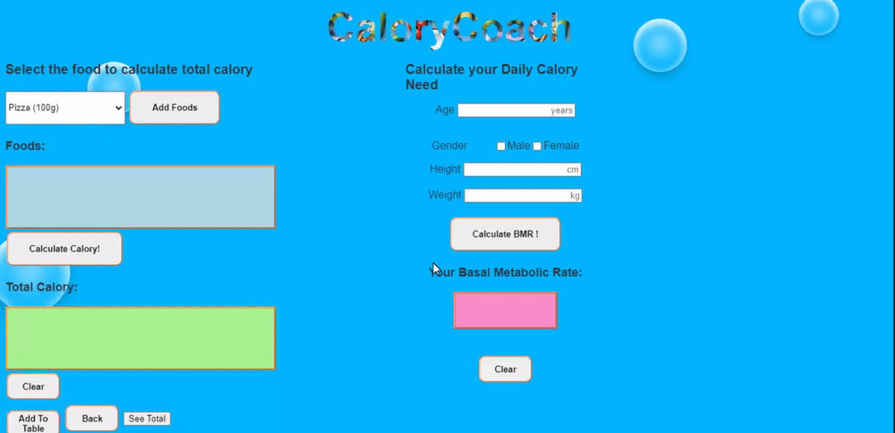
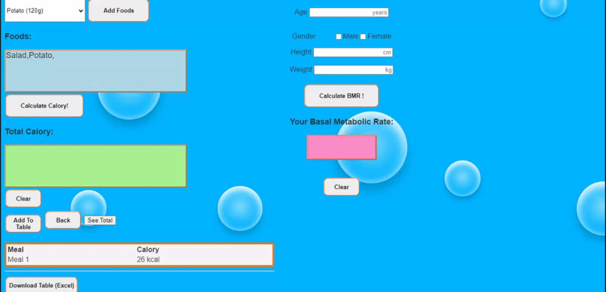
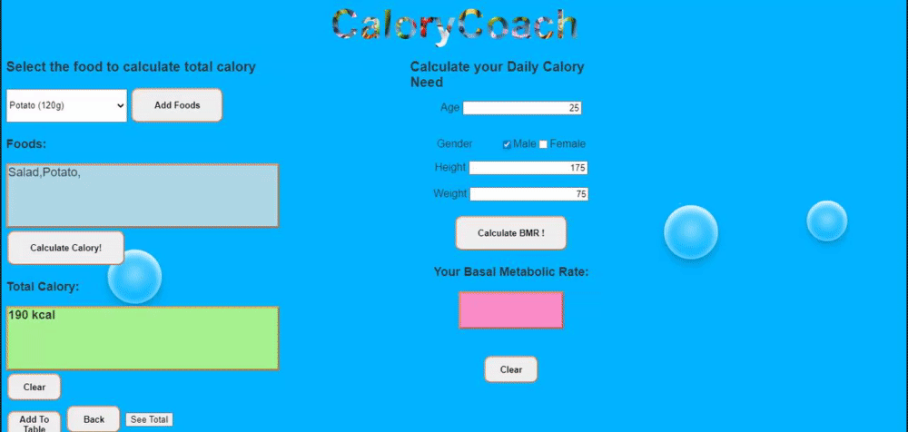

# CaloryCoach
A flask based web App which you can calculate your own daily calory need and record calories from several food options which you consumed at each meal.
Simple Register and Login mechanism.
Technologies: Python / HTML / Javascript / CSS / NodeJS(JQuery) / SQLite / SQLAlchemy

